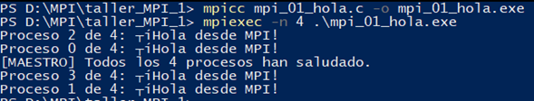
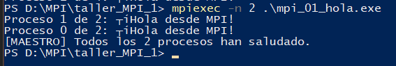
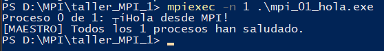
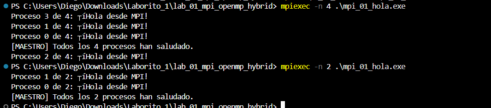
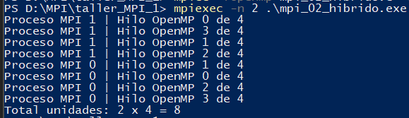
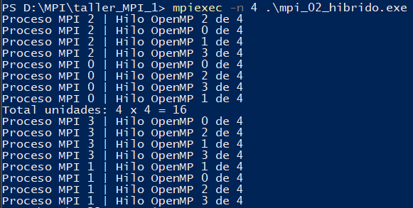
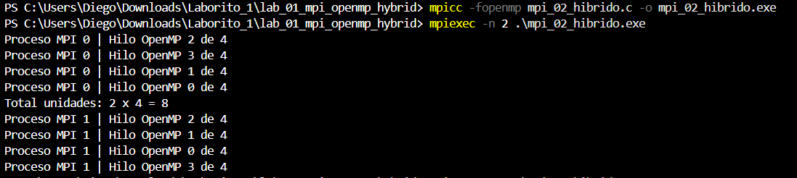
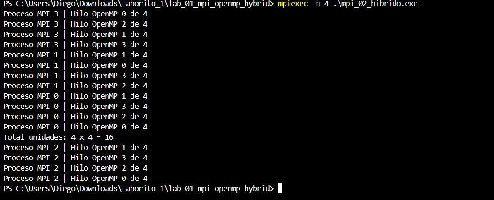
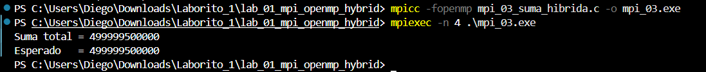
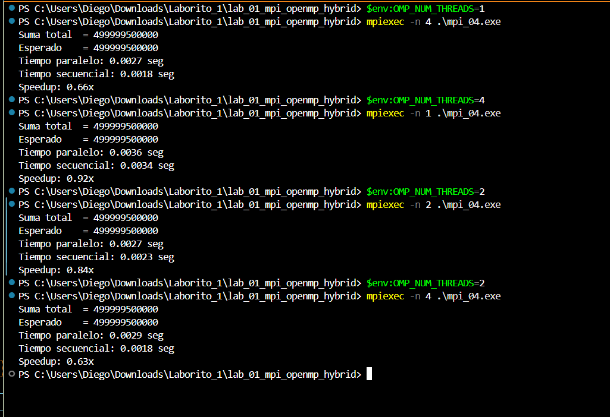

# LAB-01-MPI-OPENMP-HYBRID | BRAHAYAN ALDHAIR CAMPO SANCHEZ & DIEGO GILBERTO RODRIGUEZ

> **Asignatura:** Fundamentos de Programación Concurrente y Distribuida
> **Docente:** Prf. Alejandro Jaimes
> **Fecha:** 10/05/2025

---

# Ejercicio 1 — Hola Mundo MPI

## Descripción

Cada proceso MPI imprime su rank y el total de procesos. El proceso maestro (rank 0) imprime un mensaje adicional al final.

## Compilación y ejecución

```bash
mpicc mpi_01_hola.c -o mpi_01_hola.exe
mpiexec -n 4 .\mpi_01_hola.exe
mpiexec -n 2 .\mpi_01_hola.exe
```

## Resultados obtenidos

### Resultado — Brahayan

**4 procesos:**



**2 procesos:**



**1 proceso:**



### Resultado — Diego



## Comparación de resultados

Tanto en la ejecución de Brahayan como en la de Diego se evidencia el funcionamiento correcto de MPI, mostrando el identificador de cada proceso (rank) y el número total de procesos creados. En ambos casos el orden de aparición cambia debido a que los procesos se ejecutan de forma concurrente y no secuencial.

## Respuestas a las preguntas de análisis

### 1. ¿Por qué el orden de salida varía entre ejecuciones?

El orden de los procesos en la salida no es determinístico. Esto sucede porque los procesos se ejecutan en paralelo y el sistema operativo decide cuál proceso imprime primero.

### 2. ¿Qué pasaría si ejecutas con `-n 1`?

Al usar un único proceso la ejecución deja de ser paralela y se comporta de manera secuencial.

### 3. ¿Para qué sirve `MPI_COMM_WORLD`?

`MPI_COMM_WORLD` es el comunicador global de MPI que contiene todos los procesos creados durante la ejecución. Gracias a este comunicador los procesos pueden identificarse y comunicarse entre sí.

---

# Ejercicio 2 — OpenMP dentro de MPI

## Descripción

Dentro de cada proceso MPI se ejecuta una región paralela OpenMP con 4 hilos. Cada hilo imprime su ID junto con el rank del proceso MPI que lo contiene.

## Compilación y ejecución

```bash
mpicc -fopenmp mpi_02_hibrido.c -o mpi_02_hibrido.exe
mpiexec -n 2 .\mpi_02_hibrido.exe
mpiexec -n 4 .\mpi_02_hibrido.exe
```

## Resultados obtenidos

### Resultado — Brahayan

**2 procesos MPI × 4 hilos:**



**4 procesos MPI × 4 hilos:**



### Resultado — Diego





## Comparación de resultados

En los resultados de ambos integrantes se observa el funcionamiento híbrido entre MPI y OpenMP. Cada proceso MPI genera varios hilos OpenMP y cada hilo imprime su identificador. Tanto en las pruebas de Diego como en las de Brahayan se evidencia que los hilos pertenecen a diferentes procesos MPI y trabajan concurrentemente.

## Respuestas a las preguntas de análisis

### 1. Con 2 procesos MPI y 4 hilos OMP, ¿cuántas unidades de cómputo hay?

Existen 8 unidades de cómputo en total, ya que cada uno de los 2 procesos MPI crea 4 hilos OpenMP.

### 2. ¿Diferencia entre `-n 4` (4 MPI, 4 hilos) vs `-n 1` (1 MPI, 16 hilos)?

Con 4 procesos MPI y 4 hilos por proceso se utiliza un modelo distribuido con múltiples procesos independientes. En cambio, con 1 proceso y 16 hilos todo el trabajo ocurre dentro de la misma memoria compartida.

### 3. ¿Por qué `MPI_Init_thread` en lugar de `MPI_Init`?

Porque `MPI_Init_thread` permite el uso seguro de múltiples hilos dentro de cada proceso MPI cuando se trabaja junto con OpenMP.

---

# Ejercicio 3 — Suma Híbrida de Vector

## Descripción

El proceso maestro inicializa un vector de 1,000,000 de enteros y distribuye partes del vector usando `MPI_Scatter`. Cada proceso suma su sección utilizando OpenMP.

## Compilación y ejecución

```bash
mpicc -fopenmp mpi_03_suma_hibrida.c -o mpi_03.exe
mpiexec -n 4 .\mpi_03.exe
```

## Resultados obtenidos

### Resultado — Brahayan


### Resultado — Diego



## Comparación de resultados

En ambas ejecuciones se obtuvo correctamente la suma total del vector distribuido entre los procesos MPI. Los resultados demuestran que la combinación de MPI y OpenMP permite dividir la carga de trabajo y acelerar el cálculo de operaciones grandes.

---

# Ejercicio 4 — Medición de Speedup

## Descripción

Se compara el tiempo de ejecución secuencial frente al tiempo paralelo utilizando diferentes cantidades de procesos para calcular el speedup.

## Compilación y ejecución

```bash
mpicc -fopenmp mpi_04_speedup.c -o mpi_04.exe
mpiexec -n 4 .\mpi_04.exe
```

## Resultados obtenidos

### Resultado — Brahayan


### Resultado — Diego



## Comparación de resultados

En las pruebas realizadas por Diego y Brahayan se observa una mejora en el rendimiento al utilizar procesamiento paralelo. El speedup obtenido demuestra que el tiempo de ejecución disminuye cuando el trabajo se distribuye entre varios procesos e hilos.

---

# Conclusiones

* MPI permite distribuir procesos entre diferentes unidades de ejecución.
* OpenMP facilita el paralelismo mediante hilos dentro de un mismo proceso.
* La combinación híbrida MPI + OpenMP mejora el rendimiento en operaciones de gran tamaño.
* Los resultados obtenidos por Diego y Brahayan fueron correctos y consistentes en todos los ejercicios realizados.
