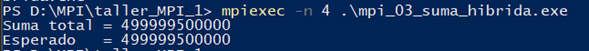
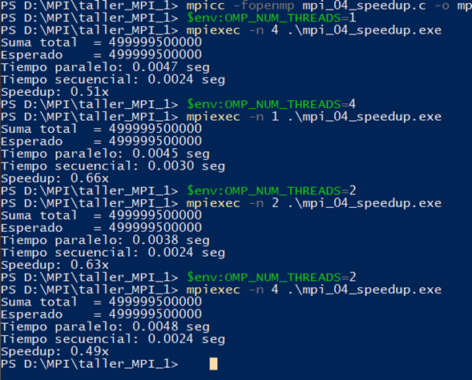
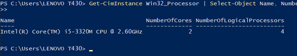

# LAB-01-MPI-OPENMP-HYBRID | BRAHAYAN ALDHAIR CAMPO SANCHEZ & DIEGO GILBERTO RODRIGEZ


> **Asignatura:** Fundamentos de Programación Concurrente y Distribuida  
> **Docente:** Prf. Alejandro Jaimes  
> **Fecha:** 10/05/2025  

## Ejercicio 1 — Hola Mundo MPI

**Descripción:** Cada proceso MPI imprime su rank y el total de procesos. El proceso maestro (rank 0) imprime un mensaje adicional al final.

**Compilación y ejecución:**
```bash
mpicc mpi_01_hola.c -o mpi_01_hola.exe
mpiexec -n 4 .\mpi_01_hola.exe
mpiexec -n 2 .\mpi_01_hola.exe
```

**Pantallazo — 4 procesos:**


**Pantallazo — 2 procesos:**


**Respuestas a las preguntas de análisis:**

1. **¿Por qué el orden de salida varía entre ejecuciones?**  

   El orden de los procesos en la salida NO es determinístico. Es normal que 'Proceso 3' aparezca antes que 'Proceso 0'. Esto es una característica del paralelismo, no un error.

2. **¿Qué pasaría si ejecutas con `-n 1`?**  

   
   
   No tiene sentido usar solo un proceso ya que no es una ejecución paralelizada ya que al trabajar con un solo hilo este se vuelve secuencial

3. **¿Para qué sirve `MPI_COMM_WORLD`?**  

   MPI_COMM_WORLD es un comunicador global de MPI el cual contiene todos los procesos que fueron creados al ejecutar el programa con mpiexec lo cual permite que cada proceso pueda comunicarse entre sí, conocer su identificador Rank y conocer el número total de procesos.
   
   Además, existen otros comunicadores personalizados para decidir procesos en grupos independientes, por lo cual funciona para organizar tareas, separar procesos por funciones, etc.


## Ejercicio 2 — OpenMP dentro de MPI

**Descripción:** Dentro de cada proceso MPI se lanza una región paralela OpenMP con 4 hilos. Cada hilo imprime su ID junto con el rank del proceso que lo contiene. Al final, el maestro calcula el total de unidades de cómputo activas.

**Compilación y ejecución:**
```bash
mpicc -fopenmp mpi_02_hibrido.c -o mpi_02_hibrido.exe
mpiexec -n 2 .\mpi_02_hibrido.exe
mpiexec -n 4 .\mpi_02_hibrido.exe
```

**Pantallazo — 2 procesos MPI × 4 hilos:**


**Pantallazo — 4 procesos MPI × 4 hilos:**


**Respuestas a las preguntas de análisis:**

1. **Con 2 procesos MPI y 4 hilos OMP, ¿cuántas unidades de cómputo hay?**  

    Hay un total de 2 procesos MPI y 4 hilos OpenMP lo cual son 8 unidades de cómputo.

2. **¿Diferencia entre `-n 4` (4 MPI, 4 hilos) vs `-n 1` (1 MPI, 16 hilos)?**  

    La diferencia entre estos dos esta en que: cuando ejecutamos con 4 procesos MPI y 4 hilos por proceso nos referimos a que existen 4 procesos independientes y cada uno de estos trabaja con 4 hilos, el cual permite que cada proceso tiene memoria compartida, y da acceso a un modelo distribuido, lo cual es funcional en múltiples nodos y cuando usamos 1 proceso con 16 hilos, es rápido solo al momento de usarlo únicamente en un solo equipo ya que los hilos están en un proceso y comparten la misma memoria.

3. **¿Por qué `MPI_Init_thread` en lugar de `MPI_Init`?**  

    Porque cuando usamos OpenMP se usan múltiples hilos dentro de un proceso MPI por lo tanto al usar MPI_Init_thread nos da soporte o permisos que le podemos dar a los hilos.

## Ejercicio 3 — Suma Híbrida de Vector

**Descripción:** El proceso maestro (Rank 0) inicializa un vector de N=1,000,000 enteros, donde cada elemento vale su índice (arr[i] = i). Se debe calcular la suma total de todos los elementos usando MPI_Scatter para distribuir secciones del vector y OpenMP para sumar cada sección en paralelo.

**Compilación y ejecución:**
```bash
mpicc -fopenmp mpi_03_suma_hibrida.c -o mpi_03.exe
mpiexec -n 4 .\mpi_03.exe
```

**Pantallazo — resultado:**



**Verificación:**
```
Suma total = 499999500000
Esperado   = 499999500000  ✓
```

**Respuestas a las preguntas de análisis:**

1. **¿Qué hace exactamente `MPI_Scatter`?**  

    MPI_Scatter distribuye partes de un arreglo desde un proceso raíz hacia todos los procesos del comunicador en MPI.
    En este caso el proceso raíz 0 toma la raíz la divide en bloques y lo reparte entre los demás procesos incluido el, donde Rank quien envía y también el recibe, pero los demás procesos solo reciben.

  

2. **¿Por qué `reduction(+:suma_local)` y no una variable compartida?**  

    Porque varios hilos OpenMP actualizan la suma al mismo tiempo y si todos modificaran directamente una variable compartida, esto generaría perdidas de datos y sobre escrituras, por eso se usa una copia privada para cada hilo para que trabajen independientemente hasta que terminen y luego de que finalicen se suman al final, lo cual garantiza un resultado correcto y seguro.

3. **¿Qué pasaría si olvidaras `MPI_Reduce` e imprimieras `suma_local` en rank 0?**  

    Si olvidamos a MPI_reduce solo se imprimiría la suma parcial calculada por el proceso 0, no la suma total global. Cada proceso MPI calcula únicamente su bloque del arreglo.
    Y si solo imprimiera a Rank=0 solo nos daría el resultado del proceso 0 y eso estaría mal.

## Ejercicio 4 (Reto) — Speedup Híbrido

**Descripción:** Partiendo del Ejercicio 3, modificarás el programa para medir tres versiones de la suma y calcular el speedup de cada una.

**Compilación:**
```bash
mpicc -fopenmp mpi_04_speedup.c -o mpi_04.exe

"luego cambiamos los valores de los hilos en cada ejecución para hacer comparación"

$env:OMP_NUM_THREADS=1
mpiexec -n 4 .\mpi_04_speedup.exe

$env:OMP_NUM_THREADS=4
mpiexec -n 1 .\mpi_04_speedup.exe

$env:OMP_NUM_THREADS=2
mpiexec -n 2 .\mpi_04_speedup.exe

$env:OMP_NUM_THREADS=2
mpiexec -n 4 .\mpi_04_speedup.exe


```

**Tabla de resultados:**

| Configuración        | Tiempo secuencial (s) | Tiempo paralelo (s) | Cálculo del Speedup | Speedup |
|----------------------|----------------------:|--------------------:|--------------------:|---------:|
| Solo MPI, sin OMP    | 0.0024                | 0.0047              | 0.0024 / 0.0047     | 0.51x    |
| Solo OMP, sin MPI    | 0.0030                | 0.0045              | 0.0030 / 0.0045     | 0.66x    |
| MPI + OMP (2,2)      | 0.0024                | 0.0038              | 0.0024 / 0.0038     | 0.63x    |
| MPI + OMP (4,2)      | 0.0024                | 0.0048              | 0.0024 / 0.0048     | 0.49x    |

**Pantallazos:**






**Análisis:**

1. **¿Coincide con la Ley de Amdahl?**  

   Si se puede apreciar a pesar de que se cuenta con un equipo con bajos recursos pues excedían las capacidades del equipo, por lo tanto, en este caso y con el equipo que se cuenta se puede observar que la comunicación, sincronización y creación de hilos fue mayor a los resultados que se obtiene al paralelizar, lo que causo que aumentara el overhead y redujera el speedup.

2. **¿Por qué más procesos/hilos no siempre dan mayor speedup?**  
   
   Por que al usar mas procesos y hilos generan mas consumos adicionales como sincronización, comunicación MPI, creación de procesos creación de hilos etc.; y además esto también depende del equipo usado.

3. **¿Qué overhead introduce MPI que no existe en OpenMP puro?**  

    Con MPI se trabaja con overhead de comunicación de procesos ya que cada proceso es independiente y cada uno tiene memoria independiente en cambio con OpenMP se trabaja con memoria compartida pero dentro de un mismo proceso.
---

## Conclusiones

**Añadir minimo 4-5** conclusiones.
