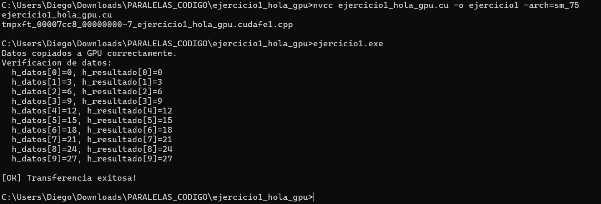

# Ejercicio 1 — Hola GPU: Mi Primer Programa CUDA

**Integrantes:** Brahayan Aldhair Campo Sanchez — Diego Gilberto Rodriguez Portilla

---

## Descripción

Inicializa un arreglo de 10 enteros en la CPU con múltiplos de 3 (`h_datos[i] = i * 3`), lo copia a la GPU usando `cudaMemcpy`, lo devuelve a la CPU y verifica elemento a elemento que los datos llegaron intactos mediante un flag `ok`.

---

## Compilación y ejecución

```bash
nvcc ejercicio1_hola_gpu.cu -o ejercicio1 -arch=sm_75
ejercicio1.exe
```

---

## Pantallazo — resultado



---

## Diferencias respecto al código base del taller

Este ejercicio no requirió modificaciones. El código del taller ya estaba completo con la verificación elemento a elemento usando el flag `ok`.

---

## Conceptos practicados

- `cudaMalloc` — reservar memoria en GPU
- `cudaMemcpy` — copiar datos CPU ↔ GPU (`cudaMemcpyHostToDevice` / `cudaMemcpyDeviceToHost`)
- `cudaFree` — liberar memoria en GPU
- Convención de nombres `h_` (host) y `d_` (device)