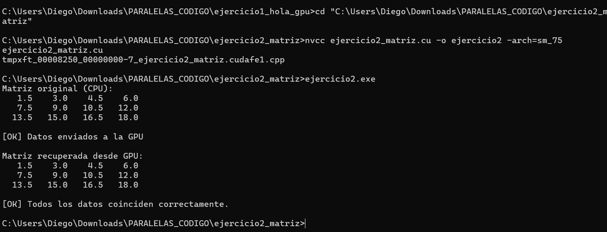

# Ejercicio 2 — Copia de Matriz 2D CPU ↔ GPU

**Integrantes:** Brahayan Aldhair Campo Sanchez — Diego Gilberto Rodriguez Portilla

---

## Descripción

Transfiere una matriz 3×4 de floats entre CPU y GPU sin realizar cálculos. Cada elemento se inicializa como `(i + 1) * 1.5f`. Después de la transferencia, verifica automáticamente que cada valor recuperado coincide con el original usando `fabsf` con una tolerancia de `1e-5f` para manejar imprecisiones de punto flotante.

---

## Compilación y ejecución

```bash
nvcc ejercicio2_matriz.cu -o ejercicio2 -arch=sm_75
ejercicio2.exe
```

---

## Pantallazo — resultado



---

## Diferencias respecto al código base del taller

El taller dejaba como TAREA implementar la verificación automática. Se agregaron dos cambios:

**1. Include de `math.h`** para poder usar `fabsf`:
```c
#include <math.h>
```

**2. Bloque de verificación con tolerancia de punto flotante:**
```c
int ok = 1;
for (int i = 0; i < N; i++) {
    if (fabsf(h_original[i] - h_recuperada[i]) >= 1e-5f) {
        printf("\nERROR en posicion %d\n", i);
        printf("Original: %.5f | Recuperado: %.5f\n",
               h_original[i], h_recuperada[i]);
        ok = 0;
    }
}
if (ok)
    printf("\n[OK] Todos los datos coinciden correctamente.\n");
else
    printf("\n[FALLO] Existen diferencias en los datos.\n");
```

Se usa `fabsf` en lugar de `==` porque comparar floats directamente puede fallar por imprecisiones de punto flotante.

---

## Conceptos practicados

- Representación de matrices 2D como arreglos 1D (`[i * cols + j]`)
- Cálculo del tamaño en bytes para arreglos multidimensionales
- Comparación de floats con tolerancia usando `fabsf`