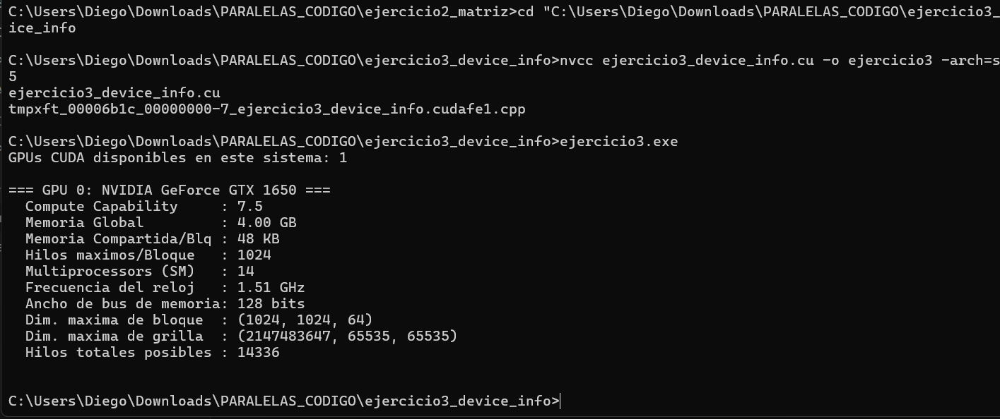

# Ejercicio 3 — Información del Device

**Integrantes:** Brahayan Aldhair Campo Sanchez — Diego Gilberto Rodriguez Portilla

---

## Descripción

Consulta e imprime las propiedades de la GPU instalada usando `cudaGetDeviceProperties`. Muestra nombre, Compute Capability, memoria global, memoria compartida por bloque, hilos máximos por bloque, número de Streaming Multiprocessors, frecuencia del reloj, ancho del bus de memoria y dimensiones máximas de bloque y grilla. Al final calcula el total de hilos que puede ejecutar simultáneamente.

---

## Compilación y ejecución

```bash
nvcc ejercicio3_device_info.cu -o ejercicio3 -arch=sm_75
ejercicio3.exe
```

---

## Pantallazo — resultado



---

## Diferencias respecto al código base del taller

El taller dejaba dos puntos pendientes:

**1. Frecuencia del reloj** — el campo `prop.clockRate` está deprecado en CUDA moderno. Se reemplazó por `cudaDeviceGetAttribute`:
```c
// Taller (deprecado):
printf("%.2f GHz\n", prop.clockRate / 1e6f);

// Corrección aplicada:
int clockRateKHz;
cudaDeviceGetAttribute(&clockRateKHz, cudaDevAttrClockRate, i);
printf("  Frecuencia del reloj   : %.2f GHz\n", clockRateKHz / 1e6f);
```

**2. Cálculo de hilos totales posibles (TAREA):**
```c
int totalHilos = prop.multiProcessorCount *
                 prop.maxThreadsPerMultiProcessor;
printf("  Hilos totales posibles : %d\n", totalHilos);
```

Para la GTX 1650: 14 SM × 1024 hilos/SM = **14,336 hilos totales**.

---

## Preguntas de análisis

**¿Qué información relevante del hardware expone `cudaGetDeviceProperties`?**

Expone toda la jerarquía de memoria (global, compartida, constante), la capacidad de cómputo (major.minor), el número de SMs, los límites de dimensiones de bloque y grilla, y el ancho del bus de memoria. Con estos datos se puede calcular la capacidad máxima de paralelismo y diseñar kernels que usen eficientemente el hardware.

**¿Para qué sirve conocer el número de SMs y `maxThreadsPerMultiProcessor`?**

Permite calcular el máximo de hilos activos simultáneamente en la GPU (`SM × hilos/SM`). Con ese dato se puede elegir el número de bloques y hilos por bloque para saturar la GPU sin desperdiciar recursos.

---

## Conceptos practicados

- `cudaGetDeviceCount` y `cudaGetDeviceProperties`
- `cudaDeviceGetAttribute` para atributos específicos del device
- Cálculo de capacidad máxima de paralelismo de la GPU