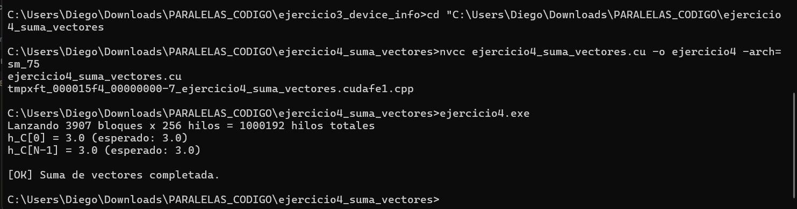

# Ejercicio 4 — Suma de Vectores Paralela

**Integrantes:** Brahayan Aldhair Campo Sanchez — Diego Gilberto Rodriguez Portilla

---

## Descripción

Suma dos vectores de 1,000,000 elementos en paralelo en la GPU. El vector `h_A` se inicializa con `1.0f` y `h_B` con `2.0f`, por lo que cada elemento del resultado debe ser `3.0f`. Cada hilo GPU procesa exactamente un par de elementos usando su índice global único. Se usan 256 hilos por bloque y se calcula el número de bloques necesarios con la fórmula `(N + THREADS - 1) / THREADS`.

---

## Compilación y ejecución

```bash
nvcc ejercicio4_suma_vectores.cu -o ejercicio4 -arch=sm_75
ejercicio4.exe
```

---

## Pantallazo — resultado



---

## Diferencias respecto al código base del taller

Este ejercicio no requirió modificaciones. El código del taller ya estaba completo con el kernel, el lanzamiento y la verificación de los primeros y últimos elementos (`h_C[0]` y `h_C[N-1]`).

---

## Preguntas de análisis

**¿Por qué se necesita el guard `if (idx < n)` dentro del kernel?**

Porque el número de bloques se redondea hacia arriba (`ceil(N / THREADS)`), lo que genera hilos extra en el último bloque. Sin el guard, esos hilos accederían a posiciones de memoria fuera del arreglo, causando comportamiento indefinido o errores de memoria.

**¿Qué significa `blockIdx.x * blockDim.x + threadIdx.x`?**

Es el índice global del hilo. `blockIdx.x` identifica el bloque, `blockDim.x` es el tamaño de cada bloque, y `threadIdx.x` es la posición del hilo dentro de su bloque. La combinación da una posición única a cada hilo en toda la grilla.

---

## Conceptos practicados

- Escritura y lanzamiento de un kernel `__global__`
- Índice global: `blockIdx.x * blockDim.x + threadIdx.x`
- Guard para evitar acceso fuera de límites: `if (idx < n)`
- Número de bloques: `(N + THREADS - 1) / THREADS`
- `cudaDeviceSynchronize()` para esperar que la GPU termine