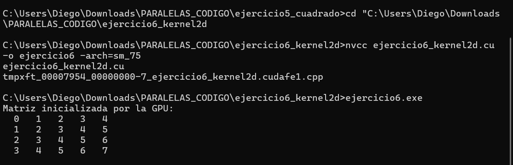

# Ejercicio 6 — Kernel 2D: Inicialización de Matriz

**Integrantes:** Brahayan Aldhair Campo Sanchez — Diego Gilberto Rodriguez Portilla

---

## Descripción

Inicializa una matriz 4×5 en la GPU usando hilos bidimensionales. Cada celda almacena la suma de su fila más su columna (`fila + col`). Se usa `dim3` para configurar las dimensiones del bloque y la grilla, y un guard 2D para evitar accesos fuera de límites.

---

## Compilación y ejecución

```bash
nvcc ejercicio6_kernel2d.cu -o ejercicio6 -arch=sm_75
ejercicio6.exe
```

---

## Pantallazo — resultado



---

## Diferencias respecto al código base del taller

El taller pedía como TAREA cambiar el valor de cada celda de índice lineal a `fila + col`. Se modificó una sola línea dentro del kernel:

```c
// Taller (original):
d_mat[idx] = idx;

// Implementación (TAREA):
d_mat[fila * cols + col] = fila + col;
```

Resultado obtenido:
```
  0   1   2   3   4
  1   2   3   4   5
  2   3   4   5   6
  3   4   5   6   7
```

---

## Preguntas de análisis

**¿Cómo se calculan `fila` y `col` a partir de las variables CUDA?**

Se combinan los índices de bloque y de hilo en cada dimensión:
```c
int col  = blockIdx.x * blockDim.x + threadIdx.x;
int fila = blockIdx.y * blockDim.y + threadIdx.y;
```
Cada hilo tiene una posición única en 2D dentro de la grilla.

**¿Por qué se necesita un guard 2D?**

Al igual que en 1D, si las dimensiones de la matriz no son múltiplos exactos del tamaño del bloque, se lanzan hilos extra. El guard `if (fila < filas && col < cols)` impide que esos hilos escriban fuera del arreglo.

---

## Conceptos practicados

- `dim3` para dimensiones 2D de bloque y grilla
- Indexación 2D: `threadIdx.x/y` y `blockIdx.x/y`
- Conversión de índice 2D a lineal: `fila * cols + col`
- Guard 2D: `if (fila < filas && col < cols)`