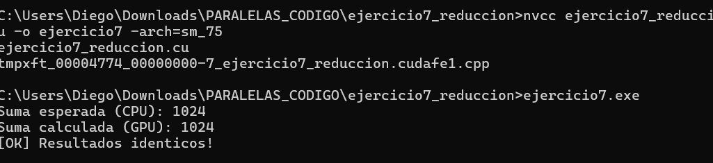

# Ejercicio 7 — Reducción Paralela con Shared Memory

**Integrantes:** Brahayan Aldhair Campo Sanchez — Diego Gilberto Rodriguez Portilla

---

## Descripción

Suma todos los elementos de un arreglo de 1,024 enteros (todos con valor `1`) usando reducción paralela con shared memory. Cada bloque reduce su porción del arreglo cargando datos en `s_datos[]`, sincronizando con `__syncthreads()` y acumulando por pasos (`stride /= 2`). Luego la CPU suma los resultados parciales de cada bloque para obtener la suma total (esperado: **1024**).

---

## Compilación y ejecución

```bash
nvcc ejercicio7_reduccion.cu -o ejercicio7 -arch=sm_75
ejercicio7.exe
```

---

## Pantallazo — resultado



---

## Diferencias respecto al código base del taller

El código original tenía un error de compilación que impedía ejecutarlo:

```
ejercicio7_reduccion.cu(43): error: expression must have a constant value
    int h_parciales[numBloques];
```

En C++ no se permiten arreglos en el stack con tamaño variable (VLA). `numBloques` se calcula en tiempo de ejecución, no es una constante en tiempo de compilación.

**Corrección aplicada:**
```c
// Taller (error de compilación):
int h_parciales[numBloques];

// Corrección con malloc:
int *h_parciales = (int*)malloc(numBloques * sizeof(int));
```

Y al final del main se agregó la liberación de memoria:
```c
free(h_parciales);
```

---

## Preguntas de análisis

**¿Por qué es obligatorio `__syncthreads()` dentro del loop de reducción?**

Porque cada iteración depende de los resultados escritos por otros hilos en la iteración anterior. Sin la barrera, un hilo podría leer `s_datos[tid + stride]` antes de que el hilo correspondiente lo haya actualizado, produciendo resultados incorrectos.

**¿Qué significa el tercer parámetro en `<<<bloques, hilos, sharedBytes>>>`?**

Indica cuántos bytes de shared memory dinámica se reservan por bloque en tiempo de ejecución. Se declara en el kernel con `extern __shared__ int s_datos[]` y el tamaño real se pasa en el lanzamiento. Esto permite que el mismo kernel funcione con distintos tamaños de bloque sin recompilar.

---

## Conceptos practicados

- Shared memory dinámica con `extern __shared__`
- Patrón de reducción paralela por pasos con `stride`
- Sincronización obligatoria con `__syncthreads()`
- Tercer parámetro del lanzamiento: `<<<bloques, hilos, sharedBytes>>>`
- Corrección de error VLA en C++ con `malloc`