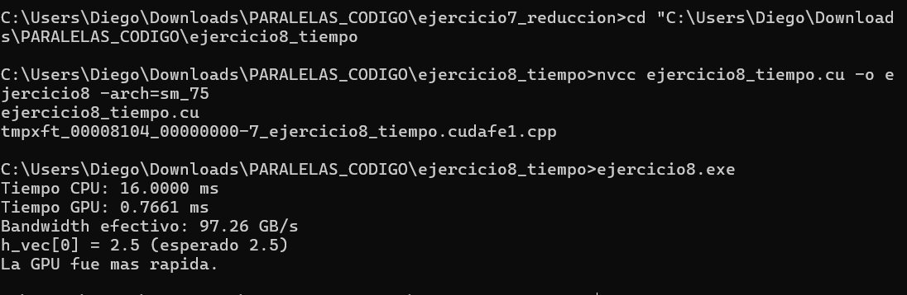

# Ejercicio 8 — Multiplicación Escalar y Medición de Tiempo

**Integrantes:** Brahayan Aldhair Campo Sanchez — Diego Gilberto Rodriguez Portilla

---

## Descripción

Multiplica 10,000,000 floats por un escalar (`2.5f`) tanto en CPU como en GPU, mide el tiempo de ambas ejecuciones y las compara. La GPU se mide con CUDA Events (`cudaEventRecord` / `cudaEventElapsedTime`) y la CPU con `clock()` de `<time.h>`. Al final calcula el bandwidth efectivo de memoria de la GPU.

---

## Compilación y ejecución

```bash
nvcc ejercicio8_tiempo.cu -o ejercicio8 -arch=sm_75
ejercicio8.exe
```

---

## Pantallazo — resultado



---

## Diferencias respecto al código base del taller

El taller solo medía tiempo en GPU y dejaba la CPU como TAREA. Se agregaron tres bloques:

**1. Medición en CPU con `clock()` antes de la prueba GPU:**
```c
clock_t inicio_cpu = clock();
for (int i = 0; i < N; i++)
    h_vec[i] *= escalar;
clock_t fin_cpu = clock();
double tiempo_cpu =
    ((double)(fin_cpu - inicio_cpu) / CLOCKS_PER_SEC) * 1000.0;
printf("Tiempo CPU: %.4f ms\n", tiempo_cpu);
```

**2. Reset del vector** para que la GPU opere con los valores originales (`1.0f`):
```c
for (int i = 0; i < N; i++)
    h_vec[i] = 1.0f;
```

**3. Comparación final de tiempos:**
```c
if (tiempo_cpu > ms)
    printf("La GPU fue mas rapida.\n");
else
    printf("La CPU fue mas rapida.\n");
```

---

## Preguntas de análisis

**¿Por qué se usa CUDA Events en lugar de `clock()` para medir la GPU?**

`clock()` mide tiempo en la CPU. Como los kernels CUDA se lanzan de forma asíncrona, `clock()` no capturaría el tiempo real de ejecución en la GPU. Los CUDA Events se insertan directamente en la cola de comandos de la GPU, por lo que `cudaEventElapsedTime` mide el tiempo real de ejecución en el device.

**¿Cómo se calcula el bandwidth efectivo?**

```c
float gb = (2.0f * bytes) / (1024^3);  // lee + escribe = 2x
float bandwidth = gb / (ms / 1000.0f);  // GB/s
```

Se multiplica por 2 porque cada elemento se lee una vez y se escribe una vez. Con N=10M floats y ~0.77 ms se obtienen aproximadamente **97 GB/s**.

---

## Resultados obtenidos

| Métrica | Valor |
|---|---|
| Tiempo CPU | ~16.00 ms |
| Tiempo GPU | ~0.77 ms |
| Speedup | ~20× más rápida en GPU |
| Bandwidth efectivo | ~97.26 GB/s |

---

## Conceptos practicados

- CUDA Events: `cudaEventCreate`, `cudaEventRecord`, `cudaEventElapsedTime`
- Medición de tiempo en CPU con `clock()` de `<time.h>`
- Cálculo de bandwidth efectivo de memoria
- Comparación de rendimiento CPU vs GPU