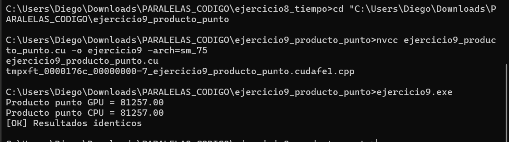

# Ejercicio 9 — Producto Punto de Vectores

**Integrantes:** Brahayan Aldhair Campo Sanchez — Diego Gilberto Rodriguez Portilla

---

## Descripción

Calcula el producto punto de dos vectores de 4,096 elementos con valores aleatorios (enteros del 0 al 9) usando reducción paralela en GPU. Cada hilo multiplica su par de elementos y los acumula en shared memory mediante el patrón de reducción por pasos. Al final se suman los resultados parciales de cada bloque en CPU y se compara contra el cálculo en CPU para verificar el resultado.

---

## Compilación y ejecución

```bash
nvcc ejercicio9_producto_punto.cu -o ejercicio9 -arch=sm_75
ejercicio9.exe
```

---

## Pantallazo — resultado



---

## Diferencias respecto al código base del taller

El taller inicializaba ambos vectores con `1.0f` y no calculaba el resultado en CPU. Se hicieron tres cambios:

**1. Vectores con valores aleatorios (TAREA):**
```c
// Taller (original):
for (int i = 0; i < N; i++) { h_A[i] = 1.0f; h_B[i] = 1.0f; }

// Implementación:
srand(time(NULL));
for (int i = 0; i < N; i++) {
    h_A[i] = (float)(rand() % 10);
    h_B[i] = (float)(rand() % 10);
}
```

**2. Cálculo del producto punto en CPU para verificar:**
```c
float resultado_cpu = 0.0f;
for (int i = 0; i < N; i++)
    resultado_cpu += h_A[i] * h_B[i];
```

**3. Comparación GPU vs CPU con reporte de diferencia:**
```c
if (resultado_gpu == resultado_cpu)
    printf("[OK] Resultados identicos\n");
else {
    printf("[ERROR] Resultados diferentes\n");
    printf("Diferencia = %.2f\n", resultado_cpu - resultado_gpu);
}
```

En la ejecución ambos coincidieron en **81,257.00**.

---

## Preguntas de análisis

**¿Por qué se combina la multiplicación con la reducción dentro del mismo kernel?**

Para evitar una pasada adicional sobre la memoria. Si primero se multiplicara y luego se redujera, se necesitaría un arreglo temporal de N elementos. Combinando ambos, `s_datos[tid] = d_A[idx] * d_B[idx]` hace la multiplicación al momento de cargar en shared memory, reduciendo tráfico de memoria global.

**¿Por qué los resultados GPU y CPU pueden diferir con datos de punto flotante?**

La adición de punto flotante no es asociativa: el orden en que se suman los valores afecta el resultado por redondeos acumulados. La reducción paralela suma en un orden diferente al loop secuencial de CPU. Con enteros pequeños (0-9) el error es cero en este ejercicio, pero con floats de mayor magnitud o precisión podría haber diferencia pequeña.

---

## Conceptos practicados

- Reducción paralela combinada con multiplicación elemento a elemento
- Shared memory dinámica con `extern __shared__ float s_datos[]`
- Inicialización aleatoria con `srand(time(NULL))` y `rand() % 10`
- Verificación de resultados GPU contra CPU con datos no triviales