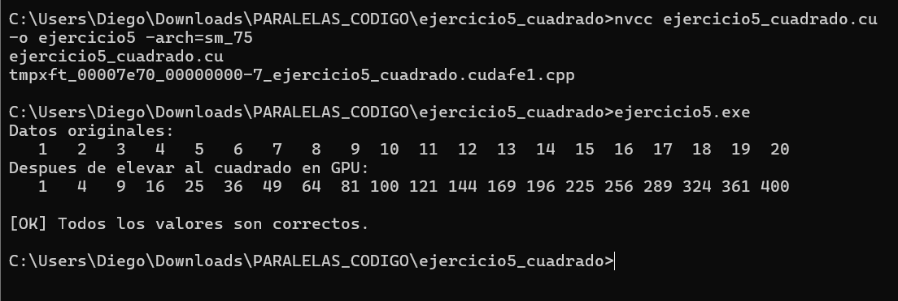

# Taller: Introducción a CUDA

| Campo | Detalle |
|---|---|
| **Materia** | Programación Paralela y Computación Distribuida |
| **Docente** | Prf. Juan Alejandro Carrillo Jaimes |
| **Semestre** | 2026-I |
| **Integrante 1** | Brahayan Aldhair Campo Sanchez — C.C. 1052379707 |
| **Integrante 2** | Diego Gilberto Rodriguez Portilla — C.C. 1098626979 |

---

## Ejercicio 1 — Hola GPU: Mi primer programa CUDA

**Descripción:**  
Inicializa un arreglo de 10 enteros en la CPU con múltiplos de 3, lo copia a la GPU
y de vuelta a la CPU, verificando elemento por elemento que los datos llegaron
intactos. Comprueba el flujo básico de transferencia CPU → GPU → CPU usando
`cudaMalloc`, `cudaMemcpy` y `cudaFree`.

**Compilación y ejecución:**
```bash
nvcc ejercicio1_hola_gpu.cu -o ejercicio1 -arch=sm_75
ejercicio1.exe
```

**Salida obtenida:**
```
Datos copiados a GPU correctamente.
Verificacion de datos:
  h_datos[0]=0, h_resultado[0]=0
  h_datos[1]=3, h_resultado[1]=3
  h_datos[2]=6, h_resultado[2]=6
  h_datos[3]=9, h_resultado[3]=9
  h_datos[4]=12, h_resultado[4]=12
  h_datos[5]=15, h_resultado[5]=15
  h_datos[6]=18, h_resultado[6]=18
  h_datos[7]=21, h_resultado[7]=21
  h_datos[8]=24, h_resultado[8]=24
  h_datos[9]=27, h_resultado[9]=27

[OK] Transferencia exitosa!
```

**Evidencia:**  


---

## Ejercicio 2 — Copia de Matriz 2D CPU ↔ GPU

**Descripción:**  
Transfiere una matriz de 3×4 floats entre CPU y GPU sin realizar cálculos en la GPU.
Imprime la matriz original y la recuperada, y verifica automáticamente que cada
elemento coincide usando `fabsf(h_original[i] - h_recuperada[i]) < 1e-5f`.

**TAREA — Verificación automática:**  
Se implementó un bucle que recorre los 12 elementos de la matriz comparando el
valor original con el recuperado desde la GPU. Si la diferencia absoluta entre
ambos supera `1e-5f` se imprime el índice y los valores en conflicto. En la
ejecución todos los elementos coincidieron exactamente.

**Compilación y ejecución:**
```bash
nvcc ejercicio2_matriz.cu -o ejercicio2 -arch=sm_75
ejercicio2.exe
```

**Salida obtenida:**
```
Matriz original (CPU):
   1.5    3.0    4.5    6.0
   7.5    9.0   10.5   12.0
  13.5   15.0   16.5   18.0

[OK] Datos enviados a la GPU

Matriz recuperada desde GPU:
   1.5    3.0    4.5    6.0
   7.5    9.0   10.5   12.0
  13.5   15.0   16.5   18.0

[OK] Todos los datos coinciden correctamente.
```

**Evidencia:**  


---

## Ejercicio 3 — Información del Device

**Descripción:**  
Consulta e imprime las propiedades de la GPU instalada usando
`cudaGetDeviceProperties`: nombre, compute capability, memoria global, memoria
compartida por bloque, hilos máximos por bloque, número de multiprocessors,
frecuencia de reloj, ancho de bus de memoria y dimensiones máximas de bloque
y grilla.

**TAREA — Hilos totales posibles:**  
Se calcula como `multiProcessorCount × maxThreadsPerMultiProcessor`.
Para la GTX 1650: **14 SM × 1024 hilos/SM = 14,336 hilos totales posibles**.
Esto representa la capacidad máxima de ejecución concurrente de la GPU.

**Compilación y ejecución:**
```bash
nvcc ejercicio3_device_info.cu -o ejercicio3 -arch=sm_75
ejercicio3.exe
```

**Salida obtenida:**
```
GPUs CUDA disponibles en este sistema: 1

=== GPU 0: NVIDIA GeForce GTX 1650 ===
  Compute Capability     : 7.5
  Memoria Global         : 4.00 GB
  Memoria Compartida/Blq : 48 KB
  Hilos maximos/Bloque   : 1024
  Multiprocessors (SM)   : 14
  Frecuencia del reloj   : 1.51 GHz
  Ancho de bus de memoria: 128 bits
  Dim. maxima de bloque  : (1024, 1024, 64)
  Dim. maxima de grilla  : (2147483647, 65535, 65535)
  Hilos totales posibles : 14336
```

**Evidencia:**  


---

## Ejercicio 4 — Suma de Vectores Paralela

**Descripción:**  
Suma dos vectores de 1,000,000 elementos en paralelo en la GPU. Cada hilo calcula
su índice global con `idx = blockIdx.x * blockDim.x + threadIdx.x` y suma el par
de elementos correspondiente. Se lanzan 3,907 bloques de 256 hilos cubriendo los
N elementos. Es el "Hola Mundo" clásico de CUDA.

**Compilación y ejecución:**
```bash
nvcc ejercicio4_suma_vectores.cu -o ejercicio4 -arch=sm_75
ejercicio4.exe
```

**Salida obtenida:**
```
Lanzando 3907 bloques x 256 hilos = 1000192 hilos totales
h_C[0] = 3.0 (esperado: 3.0)
h_C[N-1] = 3.0 (esperado: 3.0)

[OK] Suma de vectores completada.
```

**Evidencia:**  


---

## Ejercicio 5 — Cuadrado de Elementos In-place

**Descripción:**  
Eleva al cuadrado cada elemento de un arreglo del 1 al 20 directamente en la GPU
escribiendo el resultado sobre el mismo arreglo de entrada (in-place). El kernel
`cuadradoInPlace` usa un único bloque de 20 hilos, uno por elemento.

**TAREA — Verificación de resultados:**  
Se implementó un bucle que compara cada `h_datos[i]` con `(i+1)*(i+1)`. Si algún
elemento no coincide se imprime su posición, valor obtenido y valor esperado.
En la ejecución todos los 20 valores fueron correctos.

**Compilación y ejecución:**
```bash
nvcc ejercicio5_cuadrado.cu -o ejercicio5 -arch=sm_75
ejercicio5.exe
```

**Salida obtenida:**
```
Datos originales:
   1   2   3   4   5   6   7   8   9  10  11  12  13  14  15  16  17  18  19  20
Despues de elevar al cuadrado en GPU:
   1   4   9  16  25  36  49  64  81 100 121 144 169 196 225 256 289 324 361 400

[OK] Todos los valores son correctos.
```

**Evidencia:**  


---

## Ejercicio 6 — Kernel 2D: Inicialización de Matriz

**Descripción:**  
Usa un kernel con hilos bidimensionales (`dim3`) para inicializar una matriz 4×5
en la GPU. Cada hilo calcula su fila y columna a partir de `blockIdx` y `threadIdx`
en 2D, convirtiendo a índice lineal con `fila * cols + col`.

**TAREA — Modificación `mat[i][j] = i + j`:**  
Se modificó el kernel para que en lugar del índice lineal, cada celda almacene
la suma de su fila más su columna (`d_mat[idx] = fila + col`). Esto produce una
matriz donde los valores crecen tanto horizontal como verticalmente desde 0.

**Compilación y ejecución:**
```bash
nvcc ejercicio6_kernel2d.cu -o ejercicio6 -arch=sm_75
ejercicio6.exe
```

**Salida obtenida:**
```
Matriz inicializada por la GPU:
  0   1   2   3   4
  1   2   3   4   5
  2   3   4   5   6
  3   4   5   6   7
```

**Evidencia:**  


---

## Ejercicio 7 — Reducción Paralela con Shared Memory

**Descripción:**  
Suma todos los elementos de un arreglo de 1,024 enteros usando reducción paralela
con shared memory. En cada paso, la mitad de los hilos activos suman su elemento
con el del hilo a distancia `stride`, hasta que el hilo 0 del bloque acumula la
suma parcial. Los resultados parciales de cada bloque se suman finalmente en CPU.
`__syncthreads()` garantiza que todos los hilos terminen cada paso antes de
continuar.

**Nota técnica:** El código original del taller tenía un error de compilación:
`int h_parciales[numBloques]` usa tamaño variable en el stack, lo cual no es
válido en C++ estándar. Se corrigió usando
`int *h_parciales = (int*)malloc(numBloques * sizeof(int))` y se agregó
`free(h_parciales)` al final.

**Compilación y ejecución:**
```bash
nvcc ejercicio7_reduccion.cu -o ejercicio7 -arch=sm_75
ejercicio7.exe
```

**Salida obtenida:**
```
Suma esperada (CPU): 1024
Suma calculada (GPU): 1024
[OK] Resultados identicos!
```

**Evidencia:**  


---

## Ejercicio 8 — Multiplicación Escalar y Medición de Tiempo

**Descripción:**  
Multiplica 10,000,000 de floats por un escalar (2.5) en la GPU. Mide el tiempo
con CUDA Events (precisión de microsegundos) y calcula el ancho de banda efectivo
de memoria. El bandwidth se calcula como los bytes leídos y escritos
(`2 × N × sizeof(float)`) dividido entre el tiempo en segundos.

**TAREA — Comparación CPU vs GPU:**  
Se implementó la misma operación en CPU usando `clock()` antes del lanzamiento
del kernel. Los resultados obtenidos fueron:

| Métrica | Valor |
|---|---|
| Tiempo CPU | 16.00 ms |
| Tiempo GPU | 0.77 ms |
| Speedup | ~20× más rápida en GPU |
| Bandwidth efectivo | 97.26 GB/s |

La GPU fue aproximadamente 20 veces más rápida para esta operación de memoria
intensiva, lo que demuestra la ventaja del procesamiento paralelo masivo y el
alto ancho de banda de la VRAM frente a la RAM del sistema.

**Compilación y ejecución:**
```bash
nvcc ejercicio8_tiempo.cu -o ejercicio8 -arch=sm_75
ejercicio8.exe
```

**Salida obtenida:**
```
Tiempo CPU: 16.0000 ms
Tiempo GPU: 0.7661 ms
Bandwidth efectivo: 97.26 GB/s
h_vec[0] = 2.5 (esperado 2.5)
La GPU fue mas rapida.
```

**Evidencia:**  


---

## Ejercicio 9 — Producto Punto de Vectores

**Descripción:**  
Calcula el producto punto de dos vectores de 4,096 elementos usando reducción
paralela con shared memory. Cada hilo calcula `d_A[idx] * d_B[idx]` y lo carga
en shared memory; luego el bloque reduce con el mismo patrón del ejercicio 7.
La suma final de resultados parciales se hace en CPU.

**TAREA — Vectores aleatorios y verificación vs CPU:**  
Se inicializaron ambos vectores con valores aleatorios enteros entre 0 y 9 usando
`srand(time(NULL))` y `rand() % 10`. El producto punto se calculó tanto en GPU
como en CPU, comparando los resultados. En la ejecución ambos coincidieron
exactamente en **81,257.00**, confirmando la corrección del kernel con datos
no triviales.

**Compilación y ejecución:**
```bash
nvcc ejercicio9_producto_punto.cu -o ejercicio9 -arch=sm_75
ejercicio9.exe
```

**Salida obtenida:**
```
Producto punto GPU = 81257.00
Producto punto CPU = 81257.00
[OK] Resultados identicos
```

**Evidencia:**  


---

## Referencias

- NVIDIA CUDA C Programming Guide: https://docs.nvidia.com/cuda/cuda-c-programming-guide/
- CUDA C Best Practices Guide: https://docs.nvidia.com/cuda/cuda-c-best-practices-guide/
- An Even Easier Introduction to CUDA: https://developer.nvidia.com/blog/even-easier-introduction-cuda/
- CUDA Toolkit Documentation: https://docs.nvidia.com/cuda/
- Kirk, D. B. & Hwu, W. W. (2016). *Programming Massively Parallel Processors: A Hands-on Approach*. Morgan Kaufmann.
